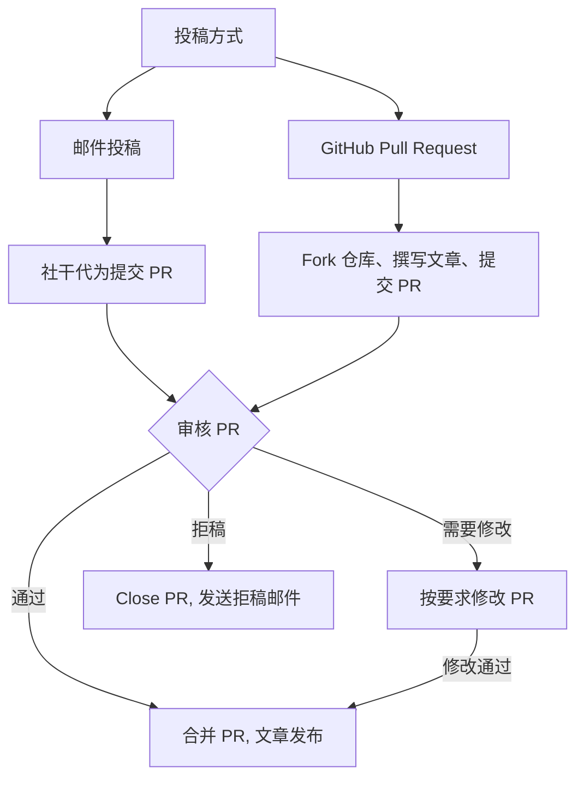

# 投稿指南

我们欢迎所有数学爱好者向我们投稿文章！
内容包括但不限于题目的分析求解、套题上传,
以及其他与数学相关的内容.

## 投稿流程

一般地, 投稿者需要先 fork 本仓库, 然后在自己的仓库中编写文章,
最后开启 Pull Request 向我们提交文章.

我们的社干会尽快审核并合并您的文章.

如果你不了解 Git 操作, 你也可以通过邮件将稿件发送至我们的 [邮箱](mailto:hyzxmath@outlook.com), 由社干代为提交.
在收到邮件后我们将尽快处理并发送回复邮件, 提交 PR 后我们会把对应的 PR 号发送至提交稿件的信箱, 之后的审核流程与正常 PR 相同.

> [!IMPORTANT]
> 投稿的审核工作完全由社干利用周末时间完成，无法保证实时处理,
> 导致我们的审核周期比较长, 短则一两天, 长则甚至需要几周, 请耐心等待 awa



## 内容要求

1. 文章内容应该与数学相关
2. 文章内容应该为原创, 或者已经获得原作者授权
   - 转载的文章***必须***特别在 Markdown Front Matter 的 license 字段和 PR 描述内注明授权信息
3. 投稿文章***必须***放到 `content/external` 目录下

> [!IMPORTANT]
> 文章内容要保证合法合规, 不得包含任何政治敏感、色情暴力、反动等不当内容, 违反上述要求的文章将被拒绝, 且提交者可能会被永久禁止投稿

## Pull Request 要求

1. 一个 PR 一件事:
   - 如果是发布文章, 那么一个 PR 一篇文章
   - 如果是修改信息, 那你可以一个 PR 同时修改多篇文章
2. PR 标题需要有 `[Article]` 前缀
3. 仅接受 Markdown (.md) 文件.
4. ***必须***勾选 PR 模板中的复选框, 确认你的 PR 符合本贡献指南中的要求, 未勾选的 PR 不予合并

## Front Matter

模板见 [`archetypes/post.md`](archetypes/post.md)

如果你在本地或 CodeSpace 内安装了 hugo-extended 的话, 你可以直接使用

```shell
$ hugo new external/name/index.md
```

创建一个带有模板 Front Matter 的空白 Markdown 文件.

请按要求填写 Front Matter.

> [!IMPORTANT]
> license 字段留空, 将会自动填充 `All Right Reserved, 河源中学数学研究协会`

